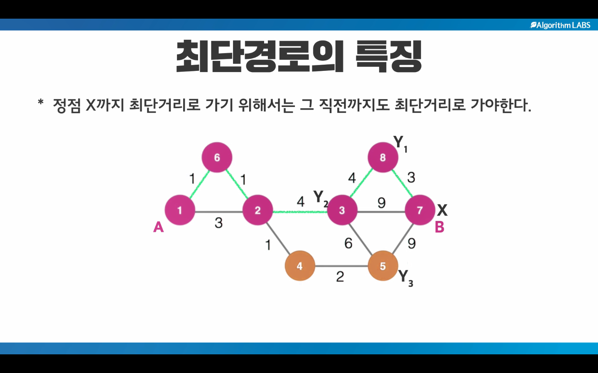

최단경로 알고리즘
=
# 특징
## i) 정점 X까지의 최단거리로 가기 위해서는 그 직전까지도 최단거리로 가야한다.
## ii) 아래 그림에서 B의 위치까지(7번 노드) 도달하기 위해서 8번,3번,5번노드 모두를 고려하여 각각의 노드까지 최단거리에서 간선 3,9,9를 각자 더했을 떄 최단거리가 되는 경로를 마지막에 채택함.
</img>

1.다익스트라 알고리즘
--------------------
 하나의 정점에서 모든 정점까지 최단거리를 구하는 알고리즘 (간선의 가중치가 양수일 떄만)
 서울을 기준으로 모든 도시까지의 거리 (1대N)
 
 <큰 그림>
 노드가 갖는 값 : 출발점으로 부터 거리
 a. 찾아! 노드가 갖는 값이 최단거리로 확정되지 않은 노드들 중에서 그 값이 최소인 노드를 
 b. 최단거리로 확정해
 c. 그 찾은 노드의 주변 노드들에 값을 업데이트해. 가중치값을 더하고 더 짧은 거리값이 나온다면.
 
2.플로이드 알고리즘
--------------------
모든 정점에서 모든 정점까지 최단거리를 구하는 알고리즘
대한민국안의 모든 도시들간의 최단거리 (N대N)

3.벨만포드 알고리즘
-------------------
하나의 정점에서 모든 정점까지 최단거리를 구하는 알고리즘
간선의 가중치가 음수일 떄도 동작하는 다익스트라알고리즘의 확장판

![Kayak][logo]

[logo]: url "To go kayaking."

Strongly Connected Component (SCC) 해법 - 코사라주 알고리즘
=
### 방향성 그래프에서 그룹핑을 하는 기법
## 1) 전체 노드를 DFS를 하면서 각 노드의 빠져나오는 시간과 그 순서를 저장한다. (배열 time[]과 order[]에)
## 2) 뒤집은 그래프에 대해서 빠져나오는 시간이 컸던 노드부터 순회. 순회를 시작하면서 이떄 만나는 모든 노드들이 같은 그룹임을 기록

Minimum Spanning Tree (MST)
=
### 사용되는 알고리즘 : 크루스칼 알고리즘
주어진 그래프의 모든 노드를 포함하는(덮는) 트리
특징 : spanning tree는 여러 경우가 나올 수 있다. 선택한 간선들의 조합이 다양하기 때문에
 간선들의 가중치의 합이 최소가 될 때, 가장 이상적인 트리가 나옴.
[기본 지식]
a. Cut Property 정리 : MST를 유지하며 두 트리를 연결하려면 가중치가 가장 낮은 간선 1개를 채택하면 됨.
b. 싸이클이 생기는 조건(피해야 할 상황) : 같은 트리내에서 두 노드를 연결할 때
   b-1. 연결하려는 두 노드를 각각 탐색하면서 같은 트리에 소속되어 있는지 체크하면 됨.
   b-2. Disjoint Set(자료구조)를 이용하여 싸이클이 생기는지 안 생기는지 알 수 있음. 

### Disjoin Set
1. 두 정점을 하나의 그룹으로 묶어라.
 - 한 가지 그룹은 한 가지 트리임.
 - 그 트리의 대표는 루트노드다.
 * 맨 처음 노드가 1 / 2 / 3 / 4 / 5 / 6 / 7 / 8 이라면 각 노드가 루트노드임.
   
   [1 2 / 3 4 합쳐라]
    1    3    5    6    7    8
   /    /
  2    4 
 
   [위 상황에서 1과 4를 합쳐라]
   각자의 트리의 루트노드를 구한다. 1 , 3
   이후에 한 루트노드를 다른 루트노드의 자식노드로 만들면 된다.
    1    5    6    7    8
   /  \  
  2    3
      /
     4 
     
  [위 상황에서 5 와 6을 묶고 그것을 1과 합쳐라]  
     1          7    8
   /  \   \
  2    3   5
      /    /
     4    6
 
2. 두 정점이 같은 그룹에 속하는가? 에 대한 대답
 - 루트노드를 찾고 그 루트노드가 동일한지 알아보면된다.
 
 

